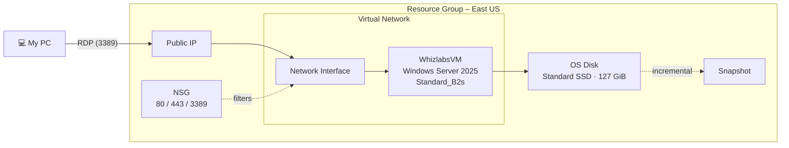

# Lab 01 – Deploy and Back Up a Windows Virtual Machine in Azure

## 📌 Overview

In this lab I deployed a **Windows Server 2025** virtual machine in Microsoft Azure using the Azure Portal, connected to it remotely over **RDP**, and protected its OS disk with an **incremental snapshot**. I finished by reviewing every resource Azure created behind the scenes and cleaning everything up to avoid unnecessary cost.

This lab covers core **AZ-900** concepts: IaaS, compute, networking basics, storage, and resource groups.

## 🎯 Objectives

- Create an Azure Virtual Machine with a defined size, image, and disk type
- Understand the supporting resources deployed with a VM
- Connect to the VM securely using Remote Desktop Protocol (RDP)
- Create an incremental snapshot of the VM's OS disk
- Validate the deployment and delete all resources

## 🧰 Azure Services Used

| Service | Purpose |
|---|---|
| Azure Virtual Machines | Compute (IaaS) running Windows Server 2025 |
| Virtual Network (VNet) | Private network the VM lives in |
| Network Interface (NIC) | Connects the VM to the VNet |
| Public IP Address | Allows access to the VM from the internet |
| Network Security Group (NSG) | Firewall rules controlling inbound traffic |
| Managed Disks | OS disk (Standard SSD) |
| Disk Snapshots | Point-in-time backup of the OS disk |
| Resource Groups | Logical container for all lab resources |

## 🏗️ Architecture

## ⚙️ VM Configuration

| Setting | Value |
|---|---|
| Region | East US |
| Image | Windows Server 2025 Datacenter: Azure Edition – x64 Gen2 |
| Size | Standard_B2s (2 vCPUs, 4 GiB RAM) |
| Availability | No infrastructure redundancy required |
| Security type | Standard |
| OS disk type | Standard SSD (LRS) |
| Inbound ports | HTTP (80), HTTPS (443), RDP (3389) |
| Boot diagnostics | Disabled |

## 🛠️ Implementation Steps

### 1. Configure the virtual machine

From the Azure Portal, I opened **Virtual machines → Create → Virtual machine** and filled in the **Basics** tab. I chose a burstable **B2s** size, which is cost-effective for light workloads and testing.

I then set a local administrator account and allowed inbound ports 80, 443, and 3389. Azure warns that this exposes the VM to all IP addresses. That's acceptable for a short-lived lab, but not for production (see *Security Considerations* below).

### 2. Choose disk and monitoring options

On the **Disks** tab I selected **Standard SSD** as a balance between cost and performance. On the **Monitoring** tab I disabled boot diagnostics to keep the lab lean.

### 3. Deploy and review created resources

After **Review + create**, the deployment completed successfully.

Expanding **Deployment details** showed that creating one VM actually deployed **five resources**: the VM, a network interface, a virtual network, a network security group, and a public IP address.

### 4. Connect to the VM over RDP

From the VM's **Connect** blade, I downloaded the RDP file, signed in with the local admin account I created, and accepted the self-signed certificate warning.

I successfully reached the Windows Server desktop running in Azure.

### 5. Create an incremental snapshot of the OS disk

Under **Settings → Disks**, I opened the OS disk and selected **Create snapshot**. I chose the **Incremental** type, which stores only changes since the last snapshot and reduces storage costs compared to a full copy.

The snapshot deployed successfully and can be used to restore the disk to this point in time.

### 6. Validate and clean up

I validated the lab successfully, then deleted all resources in the resource group to stop any further billing.

## 🔐 Security Considerations

Opening RDP (3389) to the whole internet is fine for a temporary lab, but in a real environment I would:

- Restrict the NSG rule to **known source IP addresses only**
- Use **Azure Bastion** to connect without exposing a public IP
- Enable **Just-In-Time (JIT) VM access** through Microsoft Defender for Cloud
- Choose the **Trusted launch** security type for extra boot-level protection

## 💡 Key Takeaways

- A VM is never deployed alone. It depends on networking resources (VNet, NIC, NSG, public IP) that are created with it and must be managed and cleaned up too.
- **VM size** and **disk type** directly drive cost and performance, and B-series is a good fit for low, bursty workloads.
- **Snapshots** provide a fast, low-cost way to capture a disk's state before risky changes. Incremental snapshots save storage.
- **Resource groups** make cleanup simple: deleting the resources in one group removes the entire environment.
- The Azure Portal shows helpful security warnings, and reading them is part of good cloud practice.

## 🎓 AZ-900 Concepts Reinforced

| Concept | How it appeared in this lab |
|---|---|
| IaaS | I managed the OS while Azure managed the hardware |
| Regions | Resources deployed to East US |
| Compute | Virtual machine sizing (B-series) |
| Networking | VNet, NIC, public IP, NSG |
| Storage | Managed disks and snapshots |
| Cost management | Right-sizing and deleting resources after use |

---

*Lab environment provided by Whizlabs hands-on labs. Write-up, screenshots, and notes are my own. Completed September 2026.*
