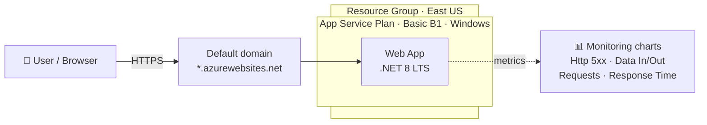
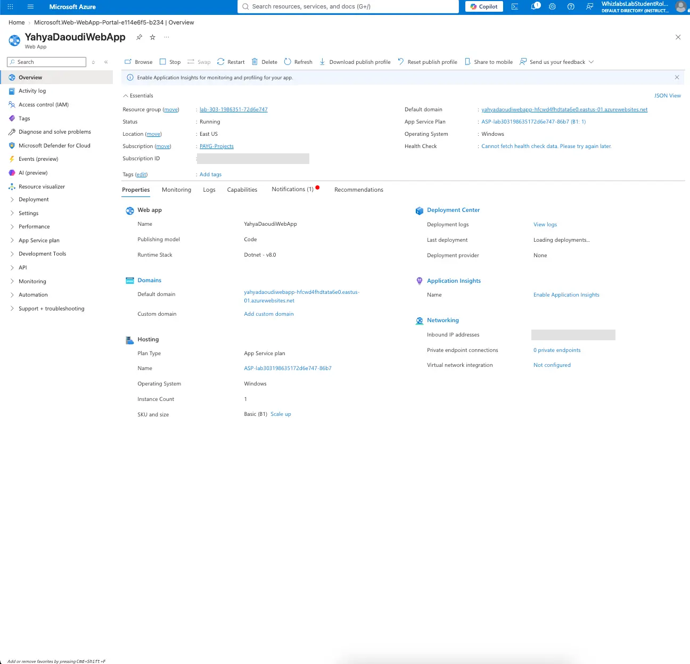

# Lab 02 – Deploy and Monitor a Web App with Azure App Service

-512BD4?logo=dotnet&logoColor=white)

## 📌 Overview

In this lab I deployed a **Windows-based web app** on **Azure App Service** using the Azure Portal, running the **.NET 8 (LTS)** runtime on a **Basic B1** App Service plan in **East US**. I tested the app through its public default domain, generated live traffic, and used the built-in **Monitoring** charts to read request and error telemetry. I finished by deleting all resources to avoid unnecessary cost.

This lab covers core **AZ-900** concepts: **PaaS** (Platform as a Service), App Service plans and pricing tiers, regions, resource groups, and basic monitoring.

## 🧰 Azure Services Used

| Service | Purpose |
|---|---|
| **Azure App Service (Web App)** | Hosts the web application without managing any servers |
| **App Service Plan (Basic B1)** | Defines the compute resources (1 vCPU, 1.75 GB RAM) the app runs on |
| **Resource Group** | Logical container for all lab resources, making cleanup easy |
| **Azure Monitor metrics** | Built-in charts for HTTP errors, data in/out, requests, and response time |

## 🏗️ Architecture

## ⚙️ Configuration

| Setting | Value |
|---|---|
| Publish | Code |
| Runtime stack | .NET 8 (LTS) |
| Operating system | Windows |
| Region | East US |
| Pricing plan | Basic B1 (100 total ACU, 1.75 GB memory, 1 vCPU) |
| Instance count | 1 |

## 🛠️ Implementation Steps

### 1. Create the Web App

1. In the Azure Portal, searched for **App Services** and selected **+ Create → Web App**.
2. On the **Basics** tab, selected the lab resource group and entered a globally unique app name.
3. Set **Publish** to *Code*, **Runtime stack** to *.NET 8 (LTS)*, **Operating System** to *Windows*, and **Region** to *East US*.
4. Under **Pricing plans**, created a new Windows App Service plan on the **Basic B1** tier.
5. Selected **Review + create → Create** and waited for the deployment to complete.

### 2. Verify and test the Web App

After deployment, I opened the resource with **Go to resource**. The Overview page confirmed the app was **Running** on Windows, with the .NET v8.0 runtime, the Code publishing model, and one instance on the Basic (B1) plan.

*Web App overview: status Running, .NET 8 on Windows, Basic B1 plan in East US (subscription ID and IP addresses redacted).*

I then opened the **Default domain** (`<app-name>.azurewebsites.net`) in a new browser tab, which displayed Azure's default page: *"Your web app is running and waiting for your content."* This confirmed the app was live and reachable over HTTPS.

### 3. Generate traffic and read the Monitoring charts

I refreshed the app URL several times to simulate a request–response cycle, then opened the **Monitoring** tab on the Overview page. After a few minutes, the charts showed the traffic:

| Metric | What it tells you |
|---|---|
| **Http 5xx** | Server-side errors. A spike can point to buggy new code, failing upstream dependencies, too much traffic, or misconfiguration. |
| **Data In** | Volume of incoming data received by the app |
| **Data Out** | Volume of outgoing data sent by the app |
| **Requests** | Number of requests received over time |
| **Response Time** | How long the app takes to respond to requests |

### 4. Validate and clean up

I validated the lab successfully, then opened the resource group, selected all resources, and chose **Delete**, typing `delete` to confirm. Deleting the App Service plan matters most here, since the plan is what incurs the cost, not the web app itself.

## 💡 Key Takeaways

- **App Service is PaaS.** Azure manages the OS, patching, and infrastructure, so I only chose a runtime and a plan. Compare this with Lab 01, where I had to manage the VM myself (IaaS).
- **The App Service plan is where cost lives.** The web app runs *on* the plan; the tier (Free, Basic, Standard, Premium) sets the CPU, memory, features, and price. One plan can host several apps.
- **App names must be globally unique** because each one becomes a public `*.azurewebsites.net` subdomain.
- **Monitoring is built in.** Without installing anything, the Overview page already shows HTTP errors, traffic, and response times. For deeper insight, **Application Insights** can be enabled.
- **Path to automation:** App Service supports CI/CD from GitHub or Azure DevOps through the Deployment Center, so code changes can deploy automatically.

## 🧹 Cleanup

All resources (Web App and App Service plan) were deleted at the end of the lab to avoid charges.

## 📚 AZ-900 Exam Relevance

| Exam domain | Concept practiced |
|---|---|
| Describe cloud concepts | PaaS vs IaaS, consumption-based pricing |
| Describe Azure architecture and services | App Service, App Service plans, regions, resource groups |
| Describe Azure management and governance | Monitoring metrics, cost awareness through cleanup |

---

⬅️ [Back to all labs](../README.md)
