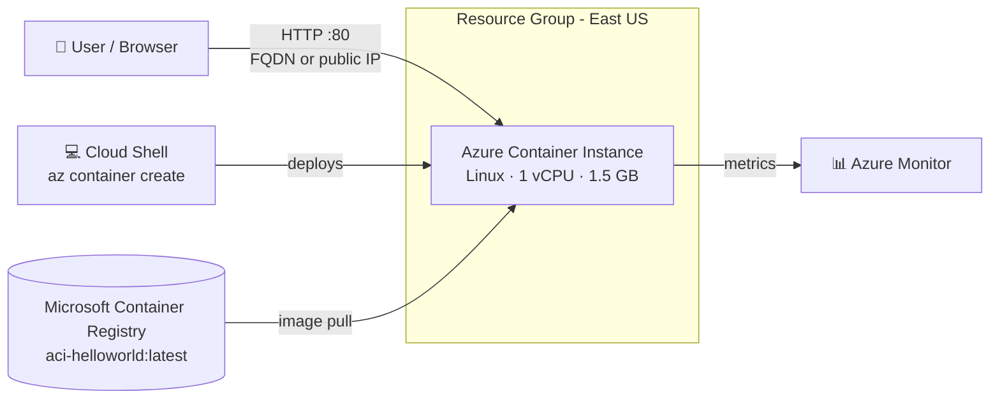
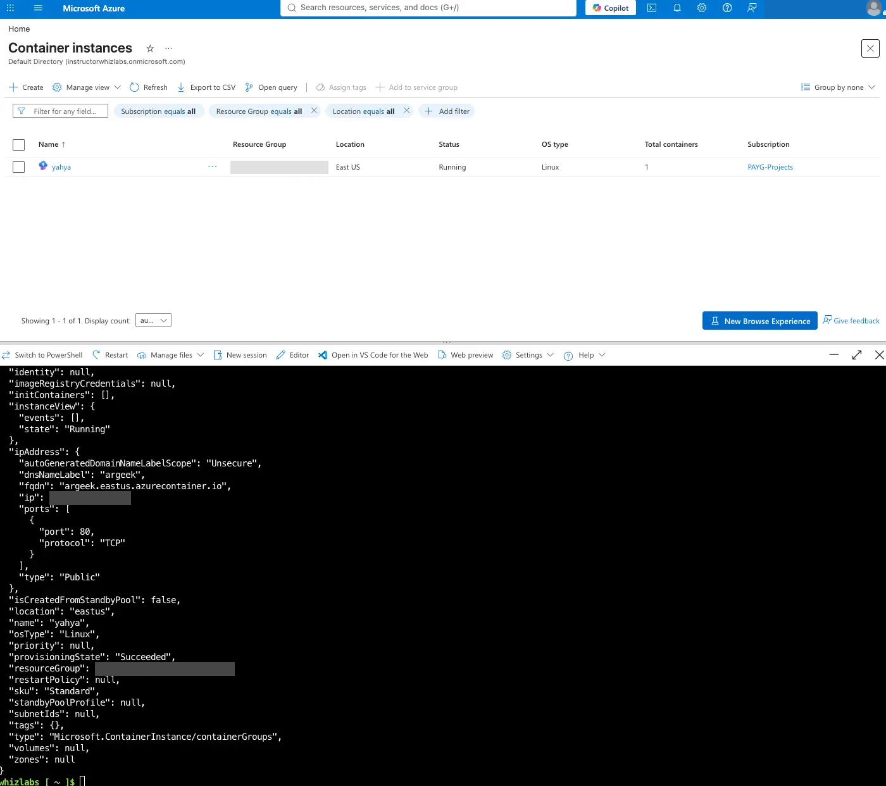

# Lab 03 – Deploy a Container with Azure Container Instances (Azure CLI)


## 📌 Overview

In this lab I deployed a containerized web application to **Azure Container Instances (ACI)** using a single **Azure CLI** command in **Azure Cloud Shell (Bash)**. The container pulled a public image from the **Microsoft Container Registry**, received a public IP and a DNS name, and served a web page on port 80 within about two minutes, with no virtual machine or cluster to manage.

I verified the deployment in the Azure Portal and in the browser, generated traffic to observe the built-in **CPU, memory, and network metrics**, and deleted all resources afterwards.

This is my first lab driven from the **command line** instead of the Portal, which is the foundation for scripting and automating Azure deployments.

## 🧰 Azure Services & Tools Used

| Service / Tool | Purpose |
|---|---|
| Azure Container Instances | Runs the container without managing servers or orchestrators |
| Azure Cloud Shell (Bash) | Browser-based terminal with the Azure CLI pre-installed |
| Azure CLI (`az container create`) | Deploys the container group in one command |
| Microsoft Container Registry (MCR) | Source of the public `aci-helloworld` image |
| Azure Monitor (Overview metrics) | CPU, memory, and network charts for the container |
| Resource Group | Logical container for the lab resources |

## 🏗️ Architecture



## ⚙️ Configuration

| Setting | Value |
|---|---|
| Container name | `yahya` |
| Image | `mcr.microsoft.com/azuredocs/aci-helloworld:latest` |
| OS type | Linux |
| CPU / Memory | 1 vCPU / 1.5 GB |
| Port | 80 (TCP, public) |
| DNS name label | `argeek` |
| FQDN | `argeek.eastus.azurecontainer.io` |
| Region | East US |
| SKU | Standard |

## 🛠️ Implementation Steps

### 1. Open Azure Cloud Shell

From the Azure Portal toolbar I opened **Cloud Shell**, chose **Bash**, and selected **No storage account required**, since this lab doesn't need files to persist between sessions.

### 2. Deploy the container with the Azure CLI

```bash
az container create \
  --resource-group <resource-group-name> \
  --name yahya \
  --image mcr.microsoft.com/azuredocs/aci-helloworld:latest \
  --dns-name-label argeek \
  --ports 80 \
  --os-type Linux \
  --cpu 1 \
  --memory 1.5
```

| Flag | What it does |
|---|---|
| `--image` | Container image to pull and run |
| `--dns-name-label` | Creates a public DNS name (`<label>.<region>.azurecontainer.io`); must be unique in the region |
| `--ports 80` | Opens port 80 on the public IP |
| `--os-type Linux` | Runs the container on a Linux host |
| `--cpu` / `--memory` | Resources reserved for the container (billed per second) |

The command returned a JSON description of the container group with `"provisioningState": "Succeeded"` and `"state": "Running"`.

A reusable version of this command is in [`deploy.sh`](deploy.sh).

### 3. Verify the deployment

In the Portal under **Container instances**, the container showed **Status: Running**, **OS type: Linux**, and **1** container. The CLI output confirmed the public IP, the FQDN, and port 80/TCP.



*Container instance running in East US (top) and the `az container create` JSON output from Cloud Shell (bottom). Sensitive values are redacted.*

Opening the FQDN in a browser displayed the **"Welcome to Azure Container Instances!"** page served by the container.

### 4. Generate traffic and review metrics

I refreshed the FQDN several times to simulate request/response traffic, then reviewed the metric charts on the container's **Overview** page:

| Metric | What it tells you |
|---|---|
| CPU (millicores) | How much compute the container is using |
| Memory | RAM consumption of the running container |
| Network bytes received | Incoming traffic volume |
| Network bytes transmitted | Outgoing traffic volume |

Metrics can take 2–5 minutes to appear after traffic is generated.

### 5. Validate and clean up

I validated the lab, then deleted the container instance from the resource group to stop billing.

The same cleanup can be done from the CLI:

```bash
az container delete --resource-group <resource-group-name> --name yahya --yes
```

## 💡 Key Takeaways

- **Containers without infrastructure.** ACI runs a container directly, with no VM (Lab 01) or App Service plan (Lab 02) to create first. It's the fastest way to run a container in Azure.
- **Per-second billing.** You pay only for the vCPU and memory while the container runs, which makes ACI ideal for short tasks, test environments, and batch jobs.
- **Azure CLI makes deployments repeatable.** One command replaced several Portal screens, and the same command can go into a script or a CI/CD pipeline.
- **DNS labels must be unique per region**, because they form a public hostname.
- **Where ACI fits:** great for simple, single-container workloads. For many containers with scaling, service discovery, and rolling updates, **Azure Kubernetes Service (AKS)** or **Azure Container Apps** are the better choices.
- **Compute options compared so far:** VM (IaaS, full control) → App Service (PaaS, code-focused) → Container Instances (serverless containers, image-focused).

## 🧹 Cleanup

The container instance was deleted at the end of the lab, and deletion was confirmed in the Portal notifications (Succeeded: 1).

## 📚 AZ-900 Exam Relevance

| Exam domain | Concept practiced |
|---|---|
| Describe cloud concepts | Serverless compute, consumption-based pricing |
| Describe Azure architecture and services | Azure Container Instances, containers vs VMs, regions, resource groups |
| Describe Azure management and governance | Azure CLI, Cloud Shell, monitoring metrics, cost control through cleanup |

---

⬅️ [Back to all labs](../README.md)
